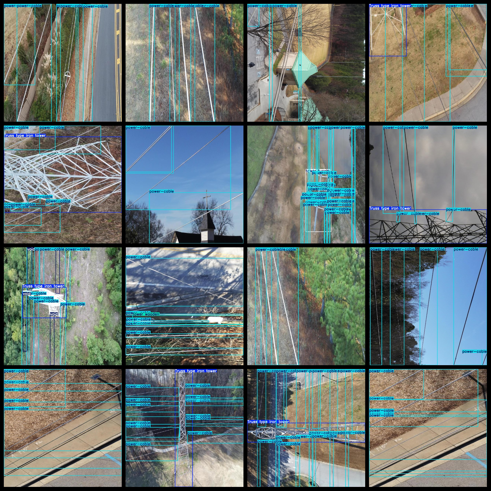
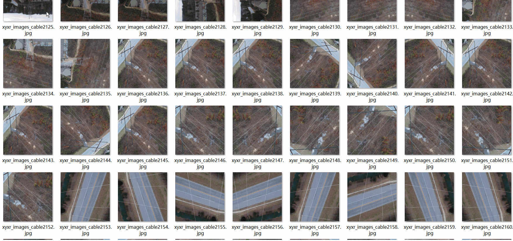

# Aerial Cable and Lose Transmission Tower Dataset 13710 imagesVOC+YOLO（(Augmented) ）

Aerial Cable and Transmission Tower Dataset 13710 VOCs + YOLOs (Enhanced)

Dataset format: Pascal VOC format + YOLO format (the txt file does not contain the split path, it only contains jpg images and corresponding VOC format xml files and yolo format txt files)

Number of images (number of jpg files): 13710

Number of xml files: 13710

Number of txt files: 13710

Number of callout categories: 5

The Github repository is: datasets_sl

["Truss type iron tower", "power-cable", "tower tucohy", "tower wooden", "void"]

Number of boxes labeled in each category:

Truss type iron tower Frame count = 4699 (Truss Iron Tower)

Power-cable frame count = 114345 (Cable)

Tower Tucohy Frames = 2650 (Concrete or steel structure hybrid tower)

Tower wooden frame count = 3678 (wooden tower)

void box = 5089

Total Frames: 130,461

Number of images per category:

Truss type iron tower has 3372 pictures.

Power-cable occupied image count = 13547

Tower Tucohy owns 1819 images.

Tower wooden possession image count = 3014

The number of images occupied by a void is 1446.

Image resolution: 1280x1280

Use the labeling tool: labelImg

Dataset Augmentation: Yes

Rules for annotation: Draw a rectangle around the category.

Important note: The dataset does not have been divided into training, validation, and testing sets.

Special Disclaimer: This dataset does not guarantee the accuracy of the trained models or weight files.

Annotation and image details are as follows:

## Images

---

Here is a pay link on Stripe (https://buy.stripe.com/3cs8yP7sY87d0vu9AB). Please contact me lonlonago@foxmail.com after funding $89, and I will send you a complete data files, thank you!

